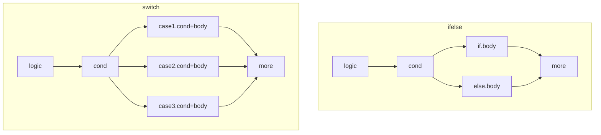
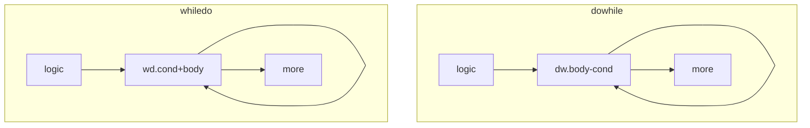

# ARM学习笔记之基础

ARM处理器则是ARM架构下的微处理器，其广泛的使用在许多嵌入式系统。ARM处理器的特点有指令长度固定、执行效率高、低成本等。ARM是一个32位RISC(精简指令集)处理器架构，RISC设计主要特点如下：

+ 寄存器：RISC的处理器拥有更多的通用寄存器，寄存器操作较多
+ 流水线：RISC采用单周期指令，且指令长度固定，便于流水线操作执行
+ 指令集：RISC减少了指令集的种类，编译器或程序员通过几条指令完成一个复杂的操作
+ LS结构：使用加载/存储指令批量从内存中读写数据，提高数据的传输效率


## 一、处理器

### 1.1 寻址空间

CPU最大能查找多大范围的地址叫做寻址能力。CPU的寻址能力以字节为单位(字节是最小可寻址单位)。

> + 内存把8bit排成一组，每一组为一个单位(字节)，CPU每次只能访问去访问一个字节，而不能去访问每一个比特。计算机系统会给内存中的每一个字节分配一个内存地址，CPU只要知道某个数据类型的地址，就可以到地址所指向的内存去读取数据。
>
> + 在32位系统中，内存地址就是32位的二进制数，所以32位地址范围就是从0x0000_0000--0xFFFF_FFFF，即一共有2的32次方个地址(2的32次方为4\*1024\*1024\*1024=4G)，每个地址对应一个字节。
>
>   > 都知道指针在32位系统上用sizeof可以得出其大小为4个字节，之前一直很奇怪为什么无论是int型还是char型，其大小都是4个字节，答案就应该是**指针是用来保存地址的，因此无论是什么类型，其大小应该都是一样的**。因此对于32位系统，内存地址是1个32位长度的二进数为4个字节；而对于64位系统则会返回8个字节。

ARM32架构处理器采用32位物理寻址机制，所支持的最大寻址空间为4GB。空间划分把虚拟地址空间划分为两部分，分别为用户空间(0G-3G，这段空间映射到物理内存的高端内存)和内核空间(3G-4G，这段空间映射到低端内存)。内核空间又分为以下四部分，分别为

+ 直接映射区(0—896M)：这段空间具体映射到物理内存的地址关系为虚拟地址3G+X=物理地址X
+ 动态映射区(896—1016M)：这段空间具体映射到物理内存的什么位置不确定，该区域的地址由内核中的vmalloc来实现分配。其特点是虚拟地址空间连续，但是物理地址空间不一定连续。vmalloc函数返回的是虚拟地址，但是其映射的物理地址有可能在高端内存，也有可能在低端内存
+ 内存映射区(1016—1020M)：使用pkmap函数将高端内存的地址映射到这部分区域，这样就可以通过这个虚拟地址来访问高端内存的地址。通过这4M的窗口可以重复映射所有的高端内存
+ 固定映射区(1020—1024M)：这4M的地址是有特定用途的固定地址，该区域映射的物理内存作为ACPI电源管理等寄存器的地址

ARM64架构处理器采用48位物理寻址机制，所支持的最大寻址空间为256TB(其虚拟地址依然采用64位，所以虚拟地址远远大于物理地址)。空间划分把虚拟地址空间划分为三部分，分别为用户空间、内核空间、非规范区，其中用户空间和内核空间每个部分最大支持256T的访问。

### 1.2 模式状态

CPU的模式可以简单的理解为当前CPU的工作状态，比如当前操作系统正在执行用户程序，那么当前CPU工作在用户模式。这时网卡上有数据到达，产生中断信号，CPU自动切换到一般中断模式下处理网卡数据(普通应用程序没有权限直接访问硬件)。处理完网卡数据，返回到用户模式下继续执行用户程序。ARM处理器支持7种运行模式，分别为

+ 用户模式(usr)：正常程序在操作系统的用户态下的常规执行，不能直接切换到其他模式。它没有权限去操作其它硬件资源(只能执行处理自己的数据)，也不能切换到其它模式下。要想访问硬件资源或切换到其它模式只能通过软中断或产生异常
+ 系统模式(sys)：运行操作系统的特权任务，具有可以直接切换到其他模式等特权。操作系统的一些特权任务可以使用这个模式访问一些受控的资源
+ 管理模式(svc)：用于操作系统保护，系统复位和软件中断响应时进入此模式(由系统调用执行软中断SWI命令触发)。管理模式是CPU上电后默认模式，因此在该模式下主要用来做系统的初始化以及软中断处理。当用户模式下的用户程序请求使用硬件资源时，通过软件中断进入该模式
+ 未定义指令中止模式(und)：用于支持硬件协处理器的软件仿真，CPU在指令的译码阶段不能识别该指令操作时，会进入该模式
+ 数据访问中止模式(abt)：用于支持虚拟内存或存储器保护，当用户程序访问非法地址(没有权限读取的内存地址时)，会进入该模式，linux下编程时经常出现的segment fault通常都是在该模式下抛出返回的
+ 外部中断模式(irq)：用于通用中断处理，可以自由访问系统硬件资源。IRQ异常响应时进入此模式
+ 快速中断模式(fiq)：用于处理对时间要求比较紧急的中断请求，主要用于高速数据传输及通道处理中。FIQ异常响应时进入此模式

特权模式下工作模式的切换可通过软件控制进行切换(即修改CPSR模式位)，即可**把状态寄存器的内容放到通用寄存器(即MRS，Move to Register from State register)**，以及**把通用寄存器的内容放到状态寄存器中(即MSR，Move to State register from Register)**，由于状态寄存器中的内容不能够直接改变，因此要先把内容复制到通用寄存器中，然后修改通用寄存器中的内容，再把通用寄存器中的内容复制给状态寄存器中，即可完成“修改状态寄存器”的任务。除用户模式外的其它模式均为特权模式。

简单来讲，ARM处理器存在两种状态：

+ ARM状态：32位指令长度，执行字对齐的32位指令
+ Thumb状态：16位指令长度，执行半字对齐的16位指令

ARM和Thumb两种状态之间的切换不影响处理器的运行模式和寄存器的内容。**ARM处理器在处理异常时，不管当前处理器处于什么状态，都将切换到ARM状态**。一般用`Bx Rn`指令来进行两种状态的切换。其中Bx是跳转指令，而Rn是寄存器(1个字，32位)，如果Rn的位0为1则进入Thumb状态；如果Rn的位0为0则进入ARM状态。原因是ARM指令的后两位始终为0而没有其他用，而Thumb指令的后一位始终为0而没有其他用，因此采用位0来表示ARM指令与Thumb指令的切换标志位。

### 1.3 软件中断

CPU和外设构成了计算机系统，它们之间通过总线进行连接，用于数据通信和控制，CPU通常以两种方式来对硬件进行管理监视：

+ 查询方式：CPU不停的去查询每一个硬件的当前状态，根据硬件的状态决定处理与否。好比是工厂里的检查员，不停的检查各个岗位工作状态，发现情况及时处理。这种方式实现起来简单，通常用在只有少量外设硬件的系统中，如果一个计算机系统中有很多硬件，这种方式无疑是耗时低效的。
+ 中断方式：当某个硬件产生需要CPU处理的事件时，主动通过一根信号线告知CPU且同时设置某个寄存器里对应的位，CPU一旦发现这根信号线上的电平有变化就会中断当前程序，然后去处理发出该中断请求。这就像是医院重危病房，病房每张病床床头有一个应急按钮，只要该张病床出现紧急情况病人按下按钮，病房监控室里电铃会响起，医护人员这时查看控制台上的指示灯，直接过去处理紧急情况。中断处理方式相对查询方式要复杂的多，并且需要硬件的支持，但是它处理的实时性更高，嵌入式系统里基本上都使用这种方式来处理。系统中断是嵌入式硬件实时地处理内部或外部事件的一种机制。对于不同CPU而言中断的处理只是细节不同，大体处理流程都一样。具体例子可以参考[这里](https://www.cnblogs.com/mr-raptor/archive/2011/06/20/2347673.html)。

当处于**用户模式**下是没有权限实现模式转换的。若想实现模式切换，只能**通过外部中断或是异常处理过程进行切换**。ARM指令集中了软中断指令SWI (SoftWare Interrupt)。**软中断**是对比硬件中断的概念，用软件方式模拟从而**实现从用户模式切换到特权模式并执行特权程序的机制**。软件中断指令用于产生软中断，实现从任意模式变换到管理模式。在这个过程中CPSR保存到管理模式的SPSR中。

==SWI==：`SWI{cond} immed_24`，其中immed_24是一个24位的立即数。该24位的立即数用来做用户程序和软中断处理程序之间的接头暗号，通过该软中断立即数来区分用户不同操作执行不同内核函数。如果用户程序调用系统调用时传递参数，根据ATPCSC语言与汇编混合编程规则，将参数放入R0~R4即可。

> 操作系统将用户程序运行在用户模式下，并且为其分配可以使用内存空间，其它内存空间不能访问；内核态运行在特权模式下，对系统所有硬件进行统一管理和控制。操作系统会将硬件的操作权限交给内核来管理(用户程序不能随意使用硬件)，使用硬件(对硬件寄存器进行读写)时要先向操作系统发出请求，操作系统内核帮助用户程序实现其操作。也就是说用户程序不会直接操作硬件，而是系统提供给用户程序一些具备预定功能的内核函数(接口)呈现给用户，系统调用把应用程序的请求传给内核，调用相应的内核函数完成所需的处理，将处理结果返回给应用程序。
>
> **[软中断处理过为](https://blog.csdn.net/zqixiao_09/article/details/50776191)**：CPU执行到swi xxx执行后产生软件中断，由异常处理部分知识可知，软中断产生后CPU将强制将PC的值置为**异常向量表地址0x08**，在异常向量表0x08处安放跳转指令HandleSWI，这样CPU就跳往我们自己定义的HandleSWI处执行。
>
> + 保护现场：软中断处理中通过STMFD SP!, {R0-R12, LR}   要保存程序执行现场，将R0~R12通用寄存器数据保存在管理模式下SP栈内，LP由硬件自动保存软中断指令的下一条指令的地址(后面利用LP的地址取得SWI指令编码)，该寄存器值也保存在SP栈内，将来处理完毕之后返回
> + 获取SWI编码：由SWI指令编码知识可知，SWI指令低24位保存有软中断号，通过LDR R4, [LR, #-4]指令，取得SWI指令编码(LP为硬件自动保存SWI xxx指令的下一条指令地址，LP–4就是SWI指令地址)，将其保存在R4寄存器中。通过BIC   R4, R4, #0xFF000000 指令将SWI指令高8位清除掉，只保留低24位立即数，取得SWI指令编码
> + 执行SWI指令：根据24位立即数中的软中断号判断用户程序的请求操作。如果24位立即数为1，表示led_on系统调用产生的软中断，则在管理模式下调用对应的亮灯操作do_led_on。如果24位立即数为2，表示led_off系统调用产生的软中断，则调用灭灯操作do_led_on，根据ATPCS调用规则R0~R3做为参数传递寄存器，在软中断处理中没有使用这4个寄存器，而是使用R4作为操作寄存器的
> + 恢复现场：执行完系统调用操作之后，返回到swi_return(在调用对应系统操作时，通过LDREQ  LR, =swi_return设置了返回地址)，执行返回处理，通过LDMIA  SP!, {R0-R12, PC}^ 指令将用户寄存器数据恢复到R0~R12，将进入软中断处理时保存的返回地址LR的值恢复给PC，实现程序返回，**同时还恢复了状态寄存器。切换回用户模式下程序中继续执行。**


## 二、寄存器

ARM处理器一般共有37个32位物理寄存器，其中包括31个通用寄存器和6个状态寄存器。下表格表明ARM状态下的寄存器组织

|  用户(usr)   | 系统(sys) |  管理(svc)   | 未定义指令中止(und) | 数据访问中止(abt) | 外部中断(irq) |        快速中断(fiq)         |
| :----------: | :-------: | :----------: | :-----------------: | :---------------: | :-----------: | :--------------------------: |
|    R0-R12    |  R0-R12   |    R0-R12    |       R0-R12        |      R0-R12       |    R0-R12     | R0-R7<br/>==R8_fiq-R12_fiq== |
|   R13(SP)    |    R13    | ==R13_svc==  |     ==R13_und==     |    ==R13_abt==    |  ==R13_irq==  |         ==R13_fiq==          |
|   R14(LP)    |    R14    | ==R14_svc==  |     ==R14_und==     |    ==R14_abt==    |  ==R14_irq==  |         ==R14_fiq==          |
| R15(PC)-CPSR | R15-CPSR  |   R15-CPSR   |      R15-CPSR       |     R15-CPSR      |   R15-CPSR    |           R15-CPSR           |
|              |           | ==SPSR_svc== |    ==SPSR_und==     |   ==SPSR_abt==    | ==SPSR_irq==  |         ==SPSR_fiq==         |


#### 通用寄存器

+ R0-R7在所有的处理器模式下指的都是同1个物理寄存器。注意在异常中断造成处理器模式切换时，由于不同的处理器模式使用相同的物理寄存器，可能造成寄存器中数据被破坏。

+ R8-R12的每个寄存器对应2个不同的物理寄存器。其中快速中断模式是单独的，另外的6个模式共用同样的处理器。

+ R13(SP)寄存器对应6个不同的物理寄存器。

  > 由于处理器的每种工作模式均有自己独立的物理寄存器R13，在用户应用程序的初始化部分，一般都要初始化每种模式下的R13，使其指向该工作模式的栈空间。
  >
  > 当进入异常模式时，可将当前模式所需要使用的寄存器保存在特定的R13所指的栈中；当退出异常处理程序返回当前模式时，将保存在特定的R13所指的栈中的寄存器值弹出。这样异常处理程序就不会破坏被其中断程序的运行现场。

+ R14(LP)寄存器对应6个不同的物理寄存器。

  > 每一种运行模式在自己的R14中存放在当前子程序的返回地址。当通过BL或BLX指令调用子程序时，R14被设置成该子程序的返回地址。在子程序中当把R14的值到程序计数器PC中时，子程序即返回。
  >
  > 当进入异常模式(异常模式也可以理解为类似子程序的跳转)时，该异常模式特定的R14被设置成该异常模式将要返回的地址，对于有些异常模式，R14的值可能与将返回的地址有一个常数的偏移量。具体的返回方式与上面的子程序返回方式基本相同。
  >
  > 另外一个要引起注意的问题是，如果子程序又调用了孙子程序，问题会如何呢？编译器会在子程序的入口处增加入栈操作将LP的值入栈，然后在子程序即将返回前增加出栈操作，将LP的值恢复(一般情况下而言，是将该值恢复到PC，从而完成返回到父程序)，从而解决这个难题。

+ R15(PC)

  > 由于ARM采用了**流水线**机制，当正确读取了PC的值时，该值为当前指令地址值加8个字节。也就是说对于ARM指令集来说，PC指向当前指令的下两条指令的地址。(因为ARM使用RISC精简指令集，ARM的一条指令所占内存为32位(4个字节)。所以当一条指令正确读取时，该寄存器指向当前指令地址加8(4*2)，即指向下两条指令的地址)。
  >
  > 有—些指令对于R15的用法有一些特殊的要求。比如指令BX利用bit[0]来确定是ARM指令，还是Thumb指令。这种读取PC值和写入PC值的不对称的操作需要特别注意。通常情况下：
  >
  > + 对于ARM指令集来说，指令是字(一个字等于该CPU总线长度)对齐的，处理器将忽略bit[1:0]，即写入R15的地址值首先与0XFFFF_FFFD做与操作后再写入R15中。
  >
  > + 对于Thumb指令集来说，指令是半字(一个字等于该CPU总线长度)对齐的。处理器将忽略bit[0]，即写入R15的地址值首先与0XFFFF_FFFE做与操作后再写入R15中。

#### 程序状态寄存器(PSR)

CPSR(当前程序状态寄存器)可以在任何处理器模式下被访问，它包含了条件标志位、中断禁止位、当前处理器模式标志等内容。每一种异常模式下都有一个专用的物理状态寄存器，称为SPSR(备份程序状态寄存器)。当特定的异常中断发生时，这个寄存器用于存放CPSR的内容。在异常中断程序退出时，可以用SPSR中保存的值来恢复CPSR。

之所以用户模式和系统模式没有SPSR，是因为通常CPU大部分时间执行在用户模式下，当产生异常或系统调用时会分别切换进入另外几种模式，保存用户模式下的状态，当切换回原先模式时，直接回复SPSR的值到CPSR就可以了。因此用户模式和系统模式下不需要SPSR。所以当在用户模式或系统模式中访问SPSR，将会产生不可预知的结果。

|  31  |  30  |  29  |  28  | ...  | ...  | ...  |  7   |  6   |  5   |  4   |  3   |  2   |  1   |  0   |
| :--: | :--: | :--: | :--: | :--: | :--: | :--: | :--: | :--: | :--: | :--: | :--: | :--: | :--: | :--: |
|  N   |  Z   |  C   |  V   |      |      |      |  I   |  F   |  T   |  M4  |  M3  |  M2  |  M1  |  M0  |

+ N(Negative)：N=1表示运算的结果为负数，N=0表示结果为正数或零
+ Z(Zero)：Z=1表示运算的结果为零，Z=0表示运算的结果不为零。对于CMP指令，Z=1表示进行比较的两个数大小相等
+ C(Carry)：下面分4种情况讨论C的设置方法：在加法指令中(包括比较指令CMN)，当结果产生了进位则C=1，表示无符号数运算发生上溢出，其他情况下C=0。在减法指令中(包括比较指令CMP)，当运算中发生借位则C=0表示无符号数运算发生下溢出，其他情况下C=1。对于包含移位操作的非加/减法运算指令，C中包含最后一次溢出的位数数值
+ V(oVerflow)：对于加/减法运算指令，当操作数和运算结果为二进制的补码表示的带符号数时，V＝1表示符号位溢出
+ I/F：当I=1时禁止IRQ中断，当F=1时禁止FIQ中断
+ T：对于ARMv4以及更高版本的T系列的ARM处理器，T=0表示执行ARM指令，T=1表示执行Thumb指令；对于ARMv5以及更高的版本的非T系列的ARM处理器，T=0表示执行ARM指令，T=1表示强制下一条执行的指令产生未定义指令中断
+ M：控制位M[4:0]控制处理器模式

在对CPSR、SPSR寄存器进行操作不能使用MOV、LDR等通用指令，只能使用特权指令MRS(Move to Register from State register)和MSR(Move to State register from Register)。

+ ==MRS==：`MRS{cond} 通用寄存器，CPSR|SPSR`，用于将程序状态寄存器的内容传送到通用寄存器中。
+ ==MSR==：`MSR{cond} CPSR|SPSR，操作数`，用于将操作数内容传送到程序状态寄存器的特定域中。操作数可以为通用寄存器或立即数。


### 三、流水线

简单来说，执行某条指令至少要通过**取指、译码、执行**三个步骤。这就好像盲人在吃饭：第一步是用筷子夹出要吃的东西(从内存中取出指令)，第二步是把吃的东西举到鼻子底下闻一下看看是否能吃(分析该指令)，第三步是放到嘴里吃(执行指令)。假设盲人只有一只手，而每一个步骤都要一秒钟的时间，那么这位盲人至少需要三秒钟才能吃到一样东西，很显然这种吃饭的方法效率低。如果CPU也采取同样的方法去运行，那就意味着CPU需消耗3个指令周期才能完成一个动作，可见其运行效率的低下。

为了弥补这个问题，ARM采用了一种多级流水线的指令执行方式，在ARM7就采用了三级流水线的处理方法，如下图所示：

```
取指  -->  译码  -->  执行
          取指  -->  译码  -->  执行
                    取指  -->  译码  -->  执行
```

这就好像一位乐于助人的科学家，知道了盲人吃饭的故事之后，给这位盲人制作了两只机械手，现在盲人已经有三只手。那么他会怎样吃饭呢？当他的第一只手此时正在从盘子里夹东西(取出指令)，第二只手已经将另外的食物凑到鼻子底下闻了(分析指令)，而第三只手把吃的送到嘴里吃的时候(执行指令)。从此盲人吃饭的效率就提高了三倍。

当ARM状态时，ARM7采用三级流水线的冯·诺伊曼结构(ARM9采用五级流水线的哈佛结构)，如下：

+ 程序计数器pc里保存着第一条指令在存储器上的地址
+ cpu译码第一条指令，同时pc自动加4(4个字节)去取下一条指令
+ cpu执行第一条指令，同时译码第二条指令，同时pc自动加4(4个字节)去取下一条指令

R15(PC)总是指向“正在取指”的指令，而不是指向“正在执行”的指令或正在“译码”的指令。一般来说人们习惯性约定将“正在执行的指令作为参考点”，称之为当前第一条指令，因此PC总是指向第三条指令。当ARM状态时，每条指令为4字节长，所以PC始终指向该指令地址加8字节的地址，即**PC值=执行的指令地址+8(字节)**。

这就是流水线的好处。ARM9设计的五级流水线，是将三极流水线中执行单元做的访问内存和寄存器回写拆分成两个单元进行执行。**但在很多时候很难达到这样的效果。如出现跳转分支指令和中断发生的时候，流水线都会阻塞，而且相邻指令之间可能因为寄存器冲突导致流水线阻塞，降低流水线的效率。**具体详情请参考程姚根老师的《ARM 流水线技术》。


### 四、指令集

### 4.1 寻址方式

**内存寻址**

如`STR R0,[R1,#-4]`将给R0的数值取出来，放到以寄存器R1的数值减去4作为地址的存储单元中

如`LDR R0,[R1,#-4]`将寄存器R1的数值减去4作为地址，取该地址存储单元的数值赋值给R0

如`STMIA R0!,{R1-R3}`将R1-R3的数据存储到寄存器R0指向的内存单元

如`LDMIA R0!,{R1-R3}`将R0指向的存储单元的3个字加载到R1-R3寄存器中

**堆栈寻址**

如`STMFD SP!,{R1-R7,LR}`将R1-R7以及LR的数据入栈，多用于保存子程序"现场"

如`LDMFD SP!,{R1-R7,LR}`将数据出栈到R1-R7以及LR，多用于恢复子程序"现场"

还有`push`和`pop`等指令，栈帧布局请参考[这里](https://blog.csdn.net/u013724573/article/details/74480261)和[这里](https://blog.csdn.net/qq_33394088/article/details/78451374?utm_medium=distribute.pc_relevant.none-task-blog-BlogCommendFromMachineLearnPai2-2.channel_param&depth_1-utm_source=distribute.pc_relevant.none-task-blog-BlogCommendFromMachineLearnPai2-2.channel_param)。

### 4.2 指令内容

ARM指令的基本格式为：`<op>[{<type>}{<mode>}{<cond>}{S}] {Rd{!}} {,...}`

+ op为指令助记符，如MOV等，这也是理解记忆的重点

+ type为数据类型，用于标注操作的数据长度

+ mode为执行模式，用于执行前后地址的处理

+ cond为条件判断，用于决定是否执行指令

+ **S为指令是否影响CPSR的值**，如ADDS\SUBS等指令会影响CPSR的

  > 指令中使用“S”后缀，在指令执行后状态寄存器的条件标志位将被刷新。此标志经常用于对条件进行测试，如是否溢出，是否进位等。根据这些变化，就可以进行一些是否大于、相等等判断，从而可能影响指令执行顺序。

+ **方括号[]括起来的表示源目标，可理解为是指针操作；括号不是结尾或最后以感叹号!结尾，表示最终地址要回写到基址寄存器中**

  > “!”后缀必须紧跟在地址表达式后面(不能用于R15(PC))，而地址表达式要有明确的地址偏移量或隐性的偏移量，如“STMDB SP!,{R3,R5,R7}”的SP的隐性偏移量是4。同时注意语法理解和区别：
  >
  > + `<op> Rd, [Rbase, Rindex]`：源地址为Rbase + Rindex所合成的有效地址
  > + `<op> Rd, [Rbase, Rindex]!`：源地址为Rbase + Rindex所合成的有效地址，并且把Rbase+Rindex的地址写回Rbase
  > + `<op> Rd, [Rbase], Rindex`：源地址为Rbase所包含的有效地址，并且把Rbase + Rindexd的地址写回Rbase

+ **上尖号^结尾，用于在重新装载R15的时候恢复PSR位**

```txt
// 常见的type
  type                 含 义
  B(SB)               无(有)符号单字节
  H(SH)               无(有)符号半个字
  D                   双字节

// 常见的mode
  mode     含 义
  IA    increase after，基址寄存器(不允许是R15)在执行指令之后增加
  IB    increase before，基址寄存器(不允许是R15)在执行指令之前增加
  DA    decrease after，基址寄存器(不允许是R15)在执行指令之后减少
  DB    decrease before，基址寄存器(不允许是R15)在执行指令之前减少
  FA    full add，满递加堆栈，堆栈向高地址生长，SP指向下一个要放入的空地址
  FD    full del，满递减堆栈，堆栈向低地址生长，SP指向最后一个入栈的有效数据项

// 常见的cond
  条件码 助记符后缀        标 志                 含 义
  0000    EQ            Z置位                 相等
  0001    NE            Z清零                 不相等

  1010    GE            N等于V                 带符号数大于或等于(great or equal)
  1101    LE            Z置位或N不等于V         带符号数小于或等于(less or equal)
  1100    GT            Z清零且N等于V           带符号数大于
  1011    LT            N不等于V               带符号数小于
  
  1000    HI            C置位Z清零             无符号数大于
  0011    LO            C清零                 无符号数小于
  0010    HS            C置位                 无符号数大于或等于(high or same)
  1001    LS            C清零Z置位             无符号数小于或等于(low or same)
  
  0100    MI            N置位                 负数
  0101    PL            N清零                 正数或零
  0110    VS            V置位                 溢出
  0111    VC            V清零                 未溢出

  1110    AL            忽略                  无条件执行
  1111    NV            忽略
```

寻址指令：

+ `STR{type}{cond} Rd, label`：翻译为store register。将Rd数据存储到label所合成的有效地址
+ `LDR{type}{cond} Rd, label`：翻译为load register。从label指向的内存中加载数据到Rd中
+ `STM{mode}{cond} Rn, reglist`：翻译为store multi。将寄存器列表数据写入到指定的存储单元中
+ `LDM{mode}{cond} Rn, reglist`：翻译为load multi。从指定的存储单元加载多个数据到寄存器列表
+ `PUSH{cond} reglist`：将寄存器列表内容推入满递减栈
+ `POP{cond} reglist`：从满递减栈弹出数据到寄存器列表

运算指令：

+ `CMP{cond} Rn,operand2`：将Rn值减去/加上op2的值，不保存结果，仅根据比较结果设置标志位

  `CMN...`：cmp not，为按cmp操作完后目标寄存器数据接着按位取反

+ `MOV{cond}{S} Rd,operand2`：将操作数传给目标寄存器Rd

  > `MVN` 不同之处是在传送之前位被反转了，所以把一个被取反的值传送到一个寄存器中。这是逻辑非操作而不是算术操作，这个取反的值加1才是它的取负的值

+ `ADD{cond}{S} Rd,Rn,operand2`：将寄存器Rn的数值加上op2的值传给目标寄存器Rd。

  `ADC...`：add c flag，为按add操作后再加上CPSR中C位的数值到目标寄存器

+ `SUB{cond}{S} Rd,Rn,operand2`：将寄存器Rn的数值减去op2的值传给目标寄存器Rd。

  `SBC...`：sub c flag，按sub操作后再减去CPSR中C位的数值到目标寄存器

+ `{S|U}MUL{L|D}{cond}{S} Rd,Rm,Rn`：将寄存器Rm的值与寄存器Rn的值相乘后低32位传给目标寄存器Rd

  `{S|U}MLA{L|D}{cond}{S}...{,Ra}`：mul add，按mul操作后再加上Ra寄存器的值的低32位(或自身组成的64位)到目标寄存器

  `{S|U}MLS{L|D}{cond}{S}...{,Ra}`：mul sub，按mul操作后再减去Ra寄存器的值的低32位(或自身组成的64位)到目标寄存器

+ `{S|U}DIV{cond}{S} Rd,Rm,Rn`：有\无符号除法指令

  `{S|U}DVA{cond}{S}...{,Ra}`：...

  `{S|U}DVS{cond}{S}...{,Ra}`：...

+ `AND|ORR|EOR{cond}{S} Rd,Rn,operand2`：逻辑与|或|异或

+ `LSL|LSR|ROL|ROR{cond}{S} Rd,Rn,operand2`：逻辑左右移/循环左右移。翻译为rotation xxx

跳转指令：

+ `B{L}{cond} label`：如果条件满足cond，跳转到寻址到label处运行。带L的话：先将寄存器PC赋值到LP(LP中存放返回地址放且PC中存放分支的地址)，然后跳转到寻址到label处运行(多用于调用子程序)。翻译为break。

其他指令：SWI和MRS\MSR等见前面，不再赘述


### 五、扩展内容

### 5.1 文件格式

```
ARM汇编中基本结构如下：
.section .rodata
  .align 2
  .arch armv7-a              @处理器架构
  .fpu softvfp               @协处理器类型
  .eabi_attribute 30,6       @接口属性
  .file "hello.c"            @源文件名称
.label:
  .section [val]             @段定义，有时也会省略.section直接定义
  .align [val]               @对齐方式，数值为2的次数方
  .global [val]              @声明全局符号,一般是函数名称。还有.ascii用于声明字符串
  .type [gvar],%[val]        @指定符号类型，也可通过.long等缩减形式
  .size [gvar], .label(点号代表从当前指令的地址算起)
```

```
具体例子如下：
.section .rodata
  .align 2
  .arch armv7-a
  .fpu softvfp
  .eabi_attribute 30,6
  .file "hello.c"
.LC0:
  .section .text
  .align 2
  .ascii "Hello ARM!\000"
  .global main
  .type main,%function
main:
  @ args = 0,pretend = 0,frame = 8
  @ frame_needed = 1,uses_anpnymous_args = 0
  stmfd sp!,(fp,lr)
  add fp,sp,#4
  ...
.LPIC0:
  add r3,px,r3
  ...
.L4:
  .align 2
.L3:
  .section .note.GNU-satck,"",%progbits @定义.note.GNU-satck段，作用是禁止生成可执行堆栈
  .word .LC0-(.LPIC0+8)     @用来存放地址值
  .size main, .-main        @用来设定符号的大小,其中的点号代表从当前指令的地址算起
  .ident "GCC (GNU) 4.4.3"  @编译器标识符，无实际用途
```

禁止生成可执行堆栈是用来保护代码安全。可执行堆栈常用来引发堆栈溢出之类的漏洞，关于这方面可查阅软件漏洞研究方面的书籍。

### 5.2 语句特点

需要熟悉语句的特点，便于快速整理出伪代码。*关于各种语句的特点，去参考《Android软件安全与逆向分析》第七章第4小节。*





