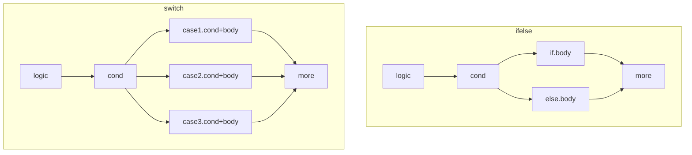
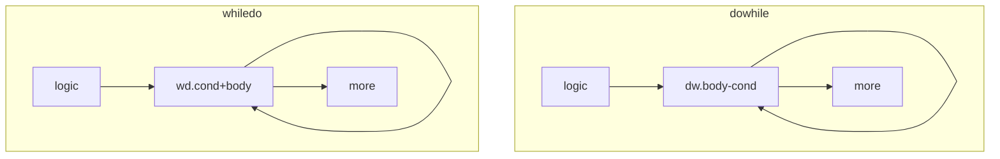

## 一、文件

ARM汇编中基本结构如下：

```
.section .rodata
  .align 2
  .arch armv7-a              @处理器架构
  .fpu softvfp               @协处理器类型
  .eabi_attribute 30,6       @接口属性
  .file "hello.c"            @源文件名称
.label:
  .section [val]             @段定义，有时也会省略.section直接定义
  .align [val]               @对齐方式，数值为2的次数方
  .global [val]              @声明全局符号,一般是函数名称。还有.ascii用于声明字符串
  .type [gvar],%[val]        @指定符号类型，也可通过.long等缩减形式
  .size [gvar], .label(点号代表从当前指令的地址算起)
```

```
.section .rodata
  .align 2
  .arch armv7-a
  .fpu softvfp
  .eabi_attribute 30,6
  .file "hello.c"
.LC0:
  .section .text
  .align 2
  .ascii "Hello ARM!\000"
  .global main
  .type main,%function
main:
  @ args = 0,pretend = 0,frame = 8
  @ frame_needed = 1,uses_anpnymous_args = 0
  stmfd sp!,(fp,lr)
  add fp,sp,#4
  ...
.LPIC0:
  add r3,px,r3
  ...
.L4:
  .align 2
.L3:
  .section .note.GNU-satck,"",%progbits @定义.note.GNU-satck段，作用是禁止生成可执行堆栈
  .word .LC0-(.LPIC0+8)     @用来存放地址值
  .size main, .-main        @用来设定符号的大小,其中的点号代表从当前指令的地址算起
  .ident "GCC (GNU) 4.4.3"  @编译器标识符，无实际用途
```

禁止生成可执行堆栈，是用来保护代码安全。可执行堆栈常常用来引发堆栈溢出之类的漏洞，关于这方面可以查阅软件漏洞研究方面的书籍。


## 二、基础

### 3.1 寄存器

ARM处理器在Thumb和ARM两种工作状态中随意切换。运行于Thumb状态时，执行的16位字对齐指令；运行于ARM状态时，执行的32位字对齐指令。在任何时候，通用寄存器R0~R14、程序计数器PC、一个状态寄存器CPSR都是可访问的。

+ 未分组寄存器：R0-R7是不分组寄存器。这意味着在所有处理器模式下，访问的都是同一个物理寄存器。R0-R3这4个寄存器用来传递函数的第1到第4个参数，超出的通过堆栈来传递；且R0寄存器通常用来存放函数调用的返回值

+ 已分组寄存器：R8-R15是已分组寄存器。**首先了解个概念：每个函数所使用的栈空间是一个栈帧**。R11用作(栈)帧指针FP，指向当前函数栈帧的栈尾；R12用作内部指针IP，是一个指令寄存器，用作临时指向；R13用作栈指针SP，指向当前函数栈帧的栈头；R14用作链接寄存器LP，指向函数的返回地址；R15被用作程序计数器PC，指向当前正在执行的指令的地址+8(因为在取地址和执行之间多了一个译码的阶段)。

+ 状态寄存器：CPSR包含条件码标志、中断禁止位、当前处理器模式以及其他状态和控制信息，主要用于运行模式、运算指令的信息记录等。

  

### 3.2 寻址

#### 直接寻址

如`MOV R0,#0x12`将十六进制0x12数值赋值给R0

#### 间接寻址

如`LDR R0,[R1,#-4]`将寄存器R1的数值减去4作为地址，取该地址存储单元的数值赋值给R0

如`STR R0,[R1,#-4]`将给R0的数值取出来，放到以寄存器R1的数值减去4作为地址的存储单元中

如`STMIA R0!,{R1-R3}`将R1-R3的数据存储到寄存器R0指向的内存单元

如`LDMIA R0!,{R1-R3}`将R0指向的存储单元的3个字加载到R1-R3寄存器中

#### 堆栈寻址

如`STMFD SP!,{R1-R7,LR}`将R1-R7以及LR的数据入栈，多用于保存子程序"现场"

如`LDMFD SP!,{R1-R7,LR}`将数据出栈到R1-R7以及LR，多用于恢复子程序"现场"


## 三、语法

### 3.1 格式

ARM指令的基本格式为：`<op>[{<type>}{<mode>}{<cond>}{S}] {Rd{!}} {,...}`

+ op为指令助记符，如MOV等，这也是理解记忆的重点
+ type为数据类型，用于标注操作的数据长度
+ mode为执行模式，用于执行前后地址的处理
+ cond为条件判断，用于决定是否执行指令
+ **S为指令是否影响CPSR的值**，如ADDS\SUBS等指令会影响CPSR的值
+ **感叹号!代表操作完的最终地址要回写到叹号附带的寄存器中**，如LDM指令

```txt
// 常见的type
  type                 含 义
  B(SB)               无(有)符号单字节
  H(SH)               无(有)符号半个字
  D                   双字节

// 常见的mode
  mode     含 义
  IA    increase after，基址寄存器(不允许是R15)在执行指令之后增加
  IB    increase before，基址寄存器(不允许是R15)在执行指令之前增加
  DA    decrease after，基址寄存器(不允许是R15)在执行指令之后减少
  DB    decrease before，基址寄存器(不允许是R15)在执行指令之前减少
  FA    full add，满递加堆栈，堆栈向高地址生长，SP指向下一个要放入的空地址
  FD    full del，满递减堆栈，堆栈向低地址生长，SP指向最后一个入栈的有效数据项

// 常见的cond
  条件码 助记符后缀        标 志                 含 义
  0000    EQ            Z置位                 相等
  0001    NE            Z清零                 不相等

  1010    GE            N等于V                 带符号数大于或等于(great or equal)
  1101    LE            Z置位或N不等于V         带符号数小于或等于(less or equal)
  1100    GT            Z清零且N等于V           带符号数大于
  1011    LT            N不等于V               带符号数小于
  
  1000    HI            C置位Z清零             无符号数大于
  0011    LO            C清零                 无符号数小于
  0010    HS            C置位                 无符号数大于或等于(high or same)
  1001    LS            C清零Z置位             无符号数小于或等于(low or same)
  
  0100    MI            N置位                 负数
  0101    PL            N清零                 正数或零
  0110    VS            V置位                 溢出
  0111    VC            V清零                 未溢出

  1110    AL            忽略                  无条件执行
  1111    NV            忽略
```

### 3.2 指令

访问：

+ `MOV{cond}{S} Rd,operand2`：将8位的立即数或寄存器内容传给目标寄存器Rd。`MVN...`为按mov操作完后目标寄存器数据接着按位取反，翻译为mov not
+ `ADR{cond} Rd,label`：它将基于PC相对偏移的地址值读取到寄存器中，翻译为add register
+ `LDR{type}{cond} Rd,{Rd2,}label`：从label指向的内存中加载数据到Rd中。翻译为load register
+ `STR{type}{cond} Rd,{Rd2,}label`：将Rd的数据写入到label指向的内存中。翻译为store register
+ `LDM{mode}{cond} Rn{!} reglist`：从指定的存储单元加载多个数据到寄存器列表(**注意与LDR的方向是相反的**)。翻译为load from multi
+ `STM{mode}{cond} Rn{!} reglist`：将寄存器列表数据写入到指定的存储单元中(**注意与STR的方向是相反的**)。翻译为store from multi
+ `PUSH{cond} reglist`：将寄存器列表内容推入满递减栈
+ `POP{cond} reglist`：从满递减栈弹出数据到寄存器列表

运算：

+ `CMP{cond} Rn,operand2`：将Rn值减去/加上op2的值，不保存结果，仅根据比较结果设置标志位

  `CMN...`：cmp not，为按cmp操作完后目标寄存器数据接着按位取反

+ `ADD{cond}{S} Rd,Rn,operand2`：将寄存器Rn的数值加上op2的值传给目标寄存器Rd。

  `ADC...`：add cflag，为按add操作后再加上CPSR中C位的数值到目标寄存器

+ `SUB{cond}{S} Rd,Rn,operand2`：将寄存器Rn的数值减去op2的值传给目标寄存器Rd。

  `SBC...`：sub cflag，按sub操作后再减去CPSR中C位的数值到目标寄存器

+ `{S|U}MUL{L|D}{cond}{S} Rd,Rm,Rn`：将寄存器Rm的值与寄存器Rn的值相乘后低32位传给目标寄存器Rd

  `{S|U}MLA{L|D}{cond}{S}...{,Ra}`：mul add，按mul操作后再加上Ra寄存器的值的低32位(或自身组成的64位)到目标寄存器

  `{S|U}MLS{L|D}{cond}{S}...{,Ra}`：mul sub，按mul操作后再减去Ra寄存器的值的低32位(或自身组成的64位)到目标寄存器

+ `{S|U}DIV{cond}{S} Rd,Rm,Rn`：有\无符号除法指令

  `{S|U}DVA{cond}{S}...{,Ra}`：...

  `{S|U}DVS{cond}{S}...{,Ra}`：...

+ `AND|ORR|EOR{cond}{S} Rd,Rn,operand2`：逻辑与|或|异或

+ `LSL|LSR|ROL|ROR{cond}{S} Rd,Rn,operand2`：逻辑左右移/循环左右移。翻译为rotation xxx

跳转：

+ `B{L}{cond} label`：如果条件满足cond，跳转到寻址到label处运行。带L的话：先将寄存器PC赋值到LP，然后跳转到寻址到label处运行(多用于调用子程序)。翻译为break


## 四、语句

需要熟悉语句的特点，便于快速整理出伪代码。*关于各种语句的特点，去参考《Android软件安全与逆向分析》第七章第4小节。*






## 五、ELF

...


