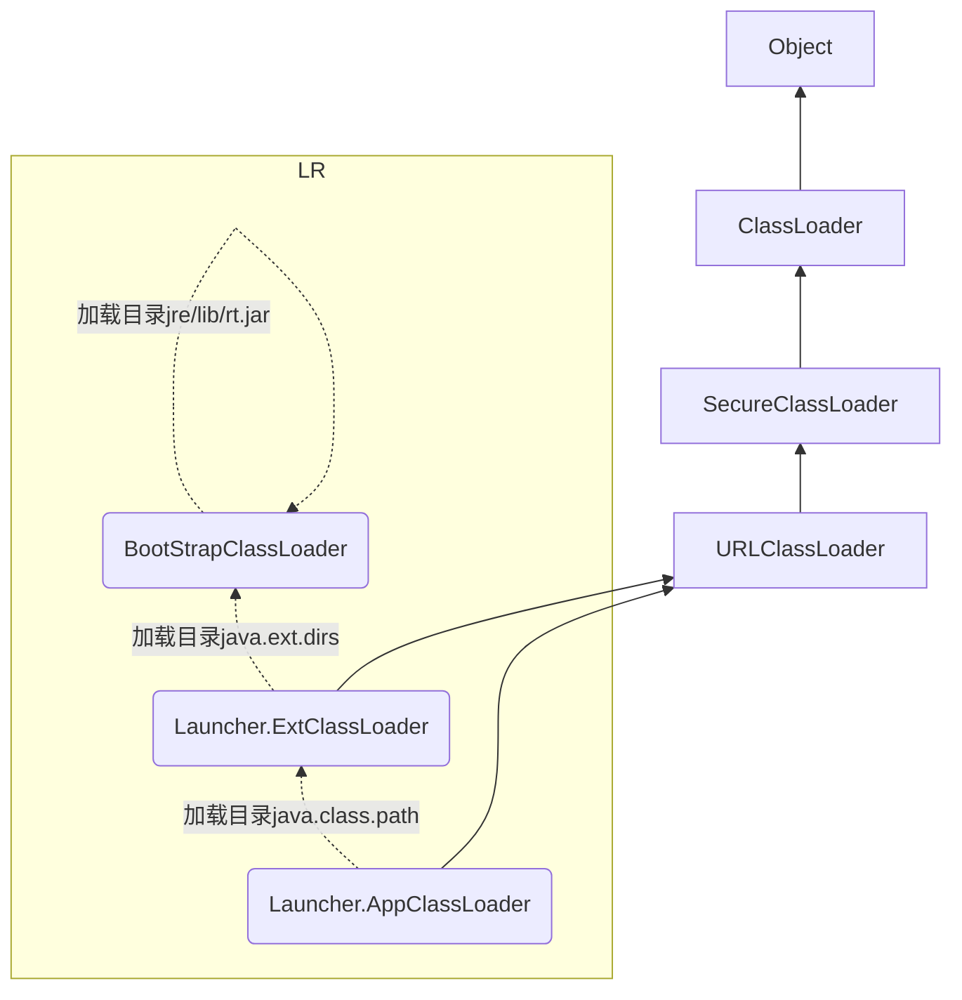

# JVM类加载子系统


通过一个类的**全限定名获取此类的二进制流**，将静态**存储结构**(见class文件结构)存储为运行时数据区中方法区的**数据结构**(在方法区对应的内存中生成一个代表这个类的java.lang.Class对象，作为方法区这个类的各种数据的访问入口)

## 一、文件结构

```
ClassFile {
    u4             magic;
    u2             minor_version;
    u2             major_version;
    
    u2             constant_pool_count;
    cp_info        constant_pool[constant_pool_count-1];
    
    u2             access_flags;
    u2             this_class;
    u2             super_class;
    u2             interfaces_count;
    u2             interfaces[interfaces_count];
    
    u2             fields_count;
    field_info     fields[fields_count];
    u2             methods_count;
    method_info    methods[methods_count];
    u2             attributes_count;
    attribute_info attributes[attributes_count];
}
```

+ **magic与version**：每个Class文件的头4个字节称为魔数(magic)，值固定为 0xCAFEBABE，表示文件类型是能够被JVM处理的Class文件。紧接着magic之后的4个字节存储的是Class 文件的次版本号和主版本号。

+ **constant_pool**：具体如下：

  常量池入口是u2类型数据，表示常量池中常量表个数。常量池计数从1开始(第0位意味不引用任何一个常量池项目)，如常量池容量为0x0016，表示常量池中有21个常量表。

  常量池信息主要存储了**字面量**以及**符号引用**。其中字面量主要包括字符串、final常量值等；符号引用主要存储接口和类的全限定名称、字段的名称以及描述符、方法的名称以及描述符。在常量池中每一个常量都是个常量表(常见的共有14中不同结构的常量表)，每个常量表都是以u1类型的标志位开始，来区分常量表的类型。

+ **access_flags、this_class、super_class和interfaces**：具体如下：

  访问标志用于识别类或接口层次的访问信息。Java定义了8种访问标志，access_flags则从8种组合而成，表示类或接口访问的类型。比如用于声明是否是接口、abstract类、final类、public类、枚举、注解等。

  Java类的继承关系由类索引、父类索引和接口索引集合三项确定。类索引、父类索引和接口索引集合按照顺序排在访问标志之后：**类索引**和**父类索引**用u2类型的索引值来表示，指向常量表类型为Constan_Class_info的类描述符，根据常量表中index值找到全限定名字符串；接口索引类似常量池，入口用一个u2类型数据来保存集合容量。集合中每项都是类型为Constan_Class_info的类描述符。

+ **fileds、methods、attributes**：字段表（filed_info）用于描述接口或者类中声明的变量和方法。

  > volatile和transient关键词不能修饰方法，方法表中访问标志因此没有ACC_VOLATILE和ACC_TRANSIENT两个标志。又由于abstract、synchronized、native、strictfp关键词可修饰方法，故方法表中又增加了ACC_ABSTRACT、ACC_SYNCHRONIZED、ACC_NATIVE、ACC_STRICTFP标志。

  ```
  field_info {
      u2             access_flags;
      u2             name_index;
      u2             descriptor_index;
      u2             attributes_count;
      attribute_info attributes[attributes_count];
  }
  
  method_info {
      u2             access_flags;
      u2             name_index;
      u2             descriptor_index;
      u2             attributes_count;
      attribute_info attributes[attributes_count];
  }
  ```

操作码的话注意函数调用指令和锁指令。


## 二、加载流程

### 2.1 Load

**2.1.1 双亲(父亲)委派机制：**

JVM对Class文件是**按需加载**的。在加载某个Classs文件时，先把这个任务递归委托给他的上级类加载器(**不是超类加载器，Parent是在构造器中传入的，一定要注意**)，如果上级类加载器没加载则自己去加载这个类。该机制的好处是避免类的重复加载，以及保证核心API的安全(防止被篡改)。

>  在JVM中表示两个class对象是否是同一个类存在两个必要条件：
>
> + 类的完整名必须一致，包括包名
> + 加载类的ClassLoader(指的是该ClassLoader的实例对象)必须相同

**2.1.2 类加载器继承图示**：



获取ClassLoader的方式一般如下：

+ `Class.getClasssLoader()`：获取当前类的ClassLoader
+ `Thread.currentThread().getContextClassLoader()`：获取当前线程的ClassLoader
+ `ClassLoader.getSystemClassLoader()`：获取系统的ClassLoader

ClassLoader是一个抽象类(不是引导类加载器)，主要方法如下：

+ `getParent()`：返回该启动器的超类加载器
+ `Class<?> loadClass(String name)`：加载名为name的类，返回Class类的实例
+ `Class<?> findClass(String name)`：查找名为name的类，返回Class类的实例
+ `Class<?> defineClass(String name, byte[] b, int off, int len)`：把字节数组b中的内容转换为一个java类，，返回Class类的实例
+ `void resolveClass(Class<?> clazz)`：连接指定的一个java类


### 2.2 Link

+ 验证阶段：保证加载的字节码是符合JVM的规范

  + 格式验证：魔数检查、版本检查(主副版本是否在当前的JVM的支持范围内)-----文件相关验证
  + 语义验证：是否有父类(Java除Object之外，其他类都有父类)、是否继承final类或方法(是否一些被定义为final的方法或者类被重写或者继承)、抽象方法是否实现-----类信息相关验证
  + 字节码验证：变量赋值是否给了正确的数据类型，函数调用是否传递了正确类型的参数，跳转指令是否指向正确位置(是否会跳转到一条不存在的指令,不能达到100%验证)。注意**栈映射帧(StackMapTable)处于该阶段，在检测特定的字节码时，其局部变量表和操作数栈是否有着正确的数据类型。**-----字段和方法相关验证
  + 符号引用验证：Class文件在常量池通过字符串记录了自己将要使用的其他类或方法。在验证阶段，虚拟机会检查类或方法是否存在、访问权限是否受限等。如果一个类在系统中找不到，则抛出NoClassDefFoundError；如果一个方法无法找到，则抛出NoSuchMethodError-----使用资源相关验证

  验证通过之后类加载器才会将类的二进制数据加载到方法区中，除格式验证之外的验证操作是在方法区中进行

+ 准备阶段：为类变量分配内存并设置为零值，主要有static变量(final变量在编译时就进行了分配，实例变量在随对象创建分配在堆中)

+ 解析阶段：将接口、字段、方法的符号引用转换为直接引用，主要有类信息(CONSSTANT_Class_info)、字段信息(CONSSTANT_Filedref_info)、方法信息(CONSSTANT_Methodref_info)

  > JVM为每个类都准备一张方法表，将其所有的方法列在其中。当需要调用一个类的方法时，只要知道这个方法在方法表的偏移量(通过解析操作，符号引用转换为直接引用类中的方法表中的位置)，就可直接调用该方法了。
  >
  > JVM规范并没有明确要求解析阶段一定要按序执行。在hotspot中链接阶段的解析操作往往伴随着jvm执行完初始化之后再执行。


### 2.3 Init

初始化就是执行类的`<clinit>`方法，如有父类则先执行父类的`<clinit>`方法，后再执行子类的`<clinit>`方法。虚拟机保证一个类的`<clinit>`方法在多线程下被同步加锁。

> 此方法不需要定义，javac自动收集static变量和static静态代码块封装而来，方法内语句顺序按照代码声明的顺序。

注意，如果仅仅使用static字段，则不会导致class的\<init\>方法执行。

具体写一个类，包含static的字段和代码块，然后编译class后javap查看即可看到`<clinit>`方法，此处忽略。


