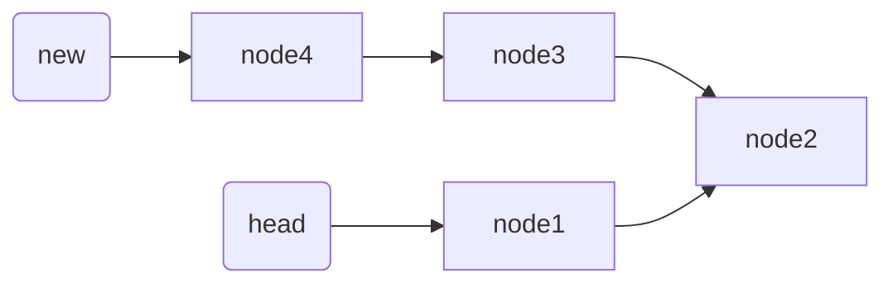
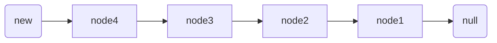

# 递归思想

## 一、基本结构

可能很多人在大一的时候，就已经接触了递归了，不过我敢保证很多人初学者刚开始接触递归的时候，是一脸懵逼的。给我的感觉就是，递归太神奇了！

+ **第一要素：明确递归函数的功能**

  对于递归很重要的一个事就是：这个函数要完成什么样的一件子事。也就是说先不管函数里面的代码什么，而是要先明白这个函数是要用来干什么。例如定义了一个函数，这个函数的功能是算 n 的阶乘：

  ```java
  // 算n的阶乘(假设n不为0)
  int f(int n){
      // todo
  }
  ```

+ **第二要素：寻找递归函数的结束条件**

  所谓递归，就是在函数内部代码中调用这个函数本身。所以必须要找出**递归的结束条件**，不然的话会一直调用自己。也就是说需要找出**当参数为什么时递归才结束，之后直接把结果返回**，请注意这个时候必须能根据这个参数的值，能够直接知道函数的结果是什么。

  例如上面那个例子，当n=1时能够直接知道f(1) = 1。完善函数内部的代码，把第二要素加进代码里面，如下

  ```java
  // 算n的阶乘(假设n不为0)
  int f(int n){
      if(n == 1){
          return 1;
      }
      // todo
  }
  ```

+ **第三要素：找出递归函数的等价关系**

  第三要素就是要**不断缩小参数的范围**，缩小之后可以通过一些辅助的变量或者操作，使原函数的结果不变。

  > 这个等价关系式的寻找，可以说是最难的一步了，需要多加练习，慢慢熟悉起来。

  例如f(n)这个范围比较大，可以让 f(n) = n * f(n-1)。这样范围就由n变成了n-1了。范围变小且为了原函数f(n) 不变，需要让 f(n-1) 乘以 n。说白了就是要找到原函数的一个等价关系式，f(n)的等价关系式为f(n) = n * f(n-1)。找出了这个等价继续完善代码，把这个等价式写进函数里，如下：

  ```java
  // 算n的阶乘(假设n不为0)
  int f(int n){
      if(n <= 2){
          return n;
      }
      // 把f(n)的等价操作写进去
      return f(n-1) * n;
  }
  ```

这就是递归结构最重要的三要素。每次做递归的时候，就强迫自己试着去寻找这三个要素。


## 二、递归优化

### 优化重复

如果使用递归的时候不进行优化，是有非常非常非常多的子问题被重复计算的。例如对于案例2那道题f(n) = f(n-1) + f(n-2)，递归调用的状态图如下：


看到没有，递归计算的时候重复计算了两次 f(5)、五次 f(4)...这是非常恐怖的。n越大，重复计算的就越多，所以必须进行优化。

如何优化？一般可以用数组或HashMap把计算的结果保证起来。例如把f(4)的计算结果保证起来，当再次要计算f(4)的时候，先判断之前是否计算过，如果计算过，直接把f(4)的结果取出来就可以；没有计算过的话再递归计算。

### 循环形式

**递归是从上往下递归到最底，再一层一层着把值返回**。不过当n比较大的时候(例如当n=10000时)，那么必须要往下递归10000层直到n <=1才将结果慢慢返回，如果n太大的话，可能栈空间会不够用。对于这种情况，**可以考虑采用循环形式(递推)的自底向上的做法**。

```java
public int f(int n){
    if(n <= 2) return n; 
    int f1 = 1;
    int f2 = 2; 
    int sum = 0; 
    for (int i = 3; i <= n; i++){ 
        sum = f1 + f2;
        f1 = f2;
        f2 = sum; 
    } 
    return sum; 
}
```


## 三、案例分析

### 案例1：斐波那契数列

> 斐波那契数列的是这样一个数列：1、1、2、3、5、8、13、21、34…，求第 n 项的值是多少

### 案例2：小青蛙跳台阶

> 一只青蛙一次可以跳上1级台阶，也可以跳上2级。求该青蛙跳上一个n级的台阶总共有多少种跳法

### 案例3：反转单链表

> 反转单链表。例如链表为1->2->3->4。反转后为4->3->2->1。其中链表的节点定义如下：
>
> ```java
> class Node{
>     int date;
>     Node next;
> }
> ```

 **1、定义递归函数功能**

假设函数reverse(head)的功能是反转链表，其中head表示链表的头节点。代码如下：

```java
Node reverse(Node head){
    // todo
}
```

**2、寻找递归函数结束条件**

当链表只有一个节点时返回。代码如下：

```java
Node reverse(Node head){
    if(head == null || head.next == null){
        return head;
    }
    // todo
}
```

 **3、寻找递归函数等价关系**

这个的等价关系不容易寻找。先缩小范围，先对 2->3->4递归下试试，即代码如下：

```java
Node reverse(Node head){ 
    if(head == null || head.next == null){
        return head; 
    } // 先把递归的结果保存起来而先不返回，因为还不清楚这样递归是对还是错
    Node newList = reverse(head.next);
    // todo
}
```

在第一步的时候就已经定义reverse函数的功能可以把一个单链表反转，所以对2->3->4反转之后的结果应该是这样：



把2->3->4递归成4->3->2。不过1这个节点并没有去碰它，所以1的next节点仍然是连接着node2。接下来该怎么办？接下来就简单了，只需要**把节点2的next指向1，然后把1的next指向null，不就行了**。即通过改变newList链表之后的结果如下：



也就是说，reverse(head) 等价于 reverse(head.next) + 改变一下1，2两个节点的指向。这样等价关系找出来了，代码如下：

```java
//用递归的方法反转链表 
public static Node reverse(Node head){ 
    // 递归结束条件
    if (head == null || head.next == null){
        return head; 
    } 
    // 递归反转子链表 
    Node newList = reverse(head.next);
    // 改变1，2节点的指向。通过head.next获取节点2 
    Node t2 = head.next; 
    // 让2的next指向2 
    t2.next = head; 
    // 1的next指向null
    head.next = null; 
    // 把调整之后的链表返回
    return newList; 
}
```


