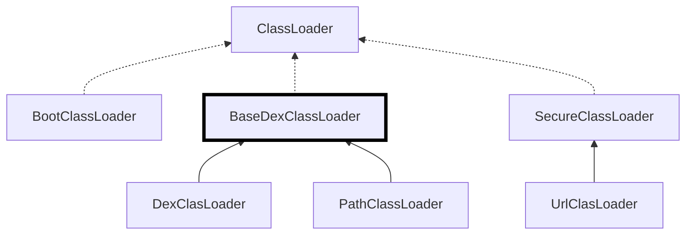

## ClassLoader

### 基本流程

在Android中使用DexClassLoader(继承ClassLoader)来加载.apk、.jar、.class文件。ClassLoader类型也可分为系统ClassLoader和自定义ClassLoader。其中系统ClassLoader包括3种分别是：

+ `BootClassLoader`：安卓系统启动时会使用BootClassLoader来预加载常用类，与Java中的Bootstrap ClassLoader不同的是，它并不是由C/C++代码实现，而是由Java实现的。BootClassLoader是ClassLoader的一个内部类
+ `PathClassLoader`：可加载已经安装的Apk(/data/app/package)，也可加载/vendor/lib、/system/lib下的nativeLibrary
+ `DexClassLoader`：可加载一个未安装的apk文件，也可加载其它包含dex文件的JAR、ZIP

最重要的`PathClassLoader`和`DexClasLoader`都继承自 `BaseDexClassLoader`，它们的类加载逻辑全部写在该类中。可以在[Android源码](http://androidxref.com/7.1.1_r6/xref/libcore/dalvik/src/main/java/dalvik/system/DexClassLoader.java)中找到这个类的实现。



```java
public class DexClassLoader extends BaseDexClassLoader {
    /**
    * dexPath：指在Androdi包含类和资源的jar/apk类型的文件集合，多个文件用“:”分隔开
    * optimizedDir：指odex优化文件存放的路径，如果为null则采用默认的系统路径
    * libraryPath：指native库文件存放目录，多个文件用“:”分隔开
    * parent：parent类加载器
    **/
    public DexClassLoader(String dexPath, String optimizedDir, String libraryPath, ClassLoader parent) {
        super(dexPath, new File(optimizedDir), libraryPath, parent);
    }
}

public class BaseDexClassLoader extends ClassLoader {
    // 作用是存放指明包含dex文件、native库和优化目录
    private final DexPathList pathList;
    
    /**
    * 追踪流程一：dex加载
    * 1、在BaseDexClassLoader对象构造方法内，创建了PathDexList对象。
    * 2、在PathDexList构造方法内部，通过DexFile.loadDex等调用一系列方法，把包含dex的文件解压缩并缓存优化后的dex文件
    * 3、在PathDexList构造方法内部，通过PathDexList的成员变量Element[] dexElements来指向缓存优化后的dex文件
    **/
    public BaseDexClassLoader(String dexPath, File optimizedDir,String libraryPath, ClassLoader parent) {
        super(parent);
        this.pathList = new DexPathList(this, dexPath, libraryPath, optimizedDir);
    }
    
    /**
    * 追踪流程二：class加载
    * 具体定义在ClassLoader类中，这里只是将代码移动过来
    * 该函数调用findLoadedClass函数
    **/
    protected Class<?> loadClass(String name, boolean resolve) throws ClassNotFoundException {
        // 首先调用findLoadedClass方法
        Class clazz = findLoadedClass(name);
        if (clazz == null) {
            long t0 = System.nanoTime();
            try {
                if (parent != null) {
                    clazz = parent.loadClass(name, false);
                } else {
                    clazz = findBootstrapClassOrNull(name);
                }
            } catch (ClassNotFoundException e) {
                // todo
            }
            
            if (clazz == null) {
                long t1 = System.nanoTime();
                // 可以看到调用了findClass方法
                clazz = findClass(name);
            }
        }
        return clazz;
    }
    
    // 追踪流程二：class加载。具体定义在ClassLoader类中，这里只是将代码移动过来。
    protected final Class<?> findLoadedClass(String name) {
        ClassLoader loader;
        if (this == BootClassLoader.getInstance())
            loader = null;
        else
            loader = this;
        // 到这里就是一个native函数的调用。java层结束
        return VMClassLoader.findLoadedClass(loader, name);
    }

    /**
    * 追踪流程三：class查询
    * 1、调用的是其成员变量pathList的findClass()方法
    * 2、DexPathList最终遍历其自身的Element[] dexElements数组，获取DexFile对象来加载Class文件
    * 备注：数组的遍历是有序的，很多热修复技术就是把修复的dex文件放在DexPathList中Element[]数组的前面来达到目的
    **/
    protected Class<?> findClass(String name) throws ClassNotFoundException {
        List<Throwable> suppressedExceptions = new ArrayList<Throwable>();
        // 调用DexPathList对象的findClass()方法
        Class clazz = pathList.findClass(name, suppressedExceptions);
        if (clazz == null) {
            ClassNotFoundException cnfe = new ClassNotFoundException("...");
            for (Throwable t : suppressedExceptions) {
                cnfe.addSuppressed(t);
            }
            throw cnfe;
        }
        return clazz;
    }
    
    protected URL findResource(String name) {
        // todo...
    }
    
    public String findLibrary(String name) {
        // todo...
    }
}

final class DexPathList{
    private Element[] dexElements;
    private final Element[] nativeLibraryPathElements;
    
    // 追踪流程一：dex加载。最终通过makeDexElements->DexFile.loadDex进行加载
    public DexPathList(ClassLoader classLoader, String dexPath, String libraryPath, File optimizedDir) {
        // todo...
        dexElements = makeDexElements(splitDexPath(dexPath), optimizedDir, exceptions, classLoader);
        nativeLibraryPathElements = makePathElements(allNativeLibraryDir, exceptions, definingContext);
        // todo...
    }
    
    // 追踪流程三：class查询。调用了DexFile的loadClassBinaryName方法
    public Class findClass(String name, List<Throwable> suppressed) {
        for (Element element : dexElements) {
            DexFile dex = element.dexFile;
            if (dex != null) {
                // 调用了DexFile的loadClassBinaryName方法
                Class clazz = dex.loadClassBinaryName(name, definingContext, suppressed);
                if (clazz != null) {
                    return clazz;
                }
            }
        }
        if (dexElementsSuppressedExceptions != null) {
            suppressed.addAll(Arrays.asList(dexElementsSuppressedExceptions));
        }
        return null;
    }
    
    public URL findResource(String name) {
        // todo...
    }
    
    public String findLibrary(String name) {
        // todo...
    }
}

public final class DexFile {
    // 追踪流程一：dex加载。该函数还是构建了新的DexFile对象
    public static DexFile loadDex(String sourcePathName, String outputPathName, int flags) {
        return new DexFile(sourcePathName, outputPathName, flags, null, null);
    }
    
    // 追踪流程一：dex加载。在构造函数中调用了openDexFile函数
    DexFile(String fileName, ClassLoader loader, DexPathList.Element[] elements) throws IOException {
        mCookie = openDexFile(fileName, null, 0, loader, elements);
        mInternalCookie = mCookie;
        mFileName = fileName;
    }
    
    // 追踪流程一：dex加载。跟踪到这里，可以看到调用了native层的openDexFileNative函数
    private static Object openDexFile(String sourceName, String outputName, int flags,
                                      ClassLoader loader, DexPathList.Element[] elements) {
        // 调用了native层的openDexFileNative函数
        return openDexFileNative(new File(sourceName).getAbsolutePath(),
                                 (outputName == null)? null: new File(outputName).getAbsolutePath(),
                                 flags,loader,elements);
    }
    
    // 追踪流程一：dex加载。java层结束
    private static native Object openDexFileNative(String sourceName, String outputName, int flags,
                                                   ClassLoader loader, DexPathList.Element[] elements);
    
    // 追踪流程三：class查询。继续跟踪
    public Class loadClassBinaryName(String name, ClassLoader loader, List<Throwable> suppressed) {
        return defineClass(name, loader, mCookie, this, suppressed);
    }
    
    // 追踪流程三：class查询。跟踪到这里，可以看到调用了native层的defineClassNative函数
    private static Class defineClass(String name, ClassLoader loader, Object cookie, 
                                     DexFile dexFile, List<Throwable> suppressed) {
        Class result = null;
        try {
            // 调用了native层的defineClassNative函数
            result = defineClassNative(name, loader, cookie, dexFile);
        } catch (NoClassDefFoundError e) {
            if (suppressed != null) {
                suppressed.add(e);
            }
        } catch (ClassNotFoundException e) {
            if (suppressed != null) {
                suppressed.add(e);
            }
        }
        return result;
    }
    
    // 追踪流程三：class查询。java层结束
    private static native Class defineClassNative(String name, ClassLoader loader, 
                                                  Object cookie, DexFile dexFile)
}
```

DexClassLoader构造函数就通过遍历.apk、.jar包所有的dex、class文件，依次通过DexFile的openDexFile，把DexFile的dex文件中添加到一张表中(Hash表)。然后通过DexClassLoader的loadClass函数去加载类。**ClassLoader的各子孙类继承loadClass方法并且通常不会复写(Overriding)，所以每个类加载器的loadClass方法都会先调用parent类加载器(各种类型的类加载器在构造时都会传入一个parent类加载器)的loadClass进行加载，失败之后才会调用本类的findClass进行加载，这种工作模式被称为“双亲委派模型”。**


### 加固替换

根据上述基本流程，来重点关注一下加固方面的知识：

+ 在Android源码搜索关于ClassLoader的引用，在众多引用有一个类LoadedApk。该类是用来维护已加载的APK的信息，并且里面有个类加载器`mClassLoader`
+ 在Android源码搜索关于LoadedApk的引用，在众多引用有一个类ActivityThread。该类是用于来调度各个组件的，并且里面有个静态函数，用来获取当前activity的ActivityThread 对象

因此，可以通过如下步骤替换mClassLoader：

+ 反射调用ActivityThread.currentActivityThread拿到一个当前ActivityThread对象
+ 反射获取ActivityThread对象的final HashMap<String, WeakReference\<LoadedApk\>> mPackages成员
+ 从mPackages获取已在加载的LoadedApk对象 
+ 反射获取LoadedApk对象 的mClassLoader成员
+ 用新的XClassLoader替换原来的mClassLoader

基于以上基本原理，来看一下**Android加固简史**。

#### 加固方案版本一

加固方案：

+ 1、源APK文件存放壳APK的资源目录asset下
+ 2、使用DexClassLoader动态加载APK并运行

流程描述：

+ 1、重写Application，在attachBaseContext中进行释放资源中源APK到目标目录下，如果有SO文件也需释放到指定目录下
+ 2、在加固MainActivity中，通过自定义ClassLoader增强mClassLoader，通过loadClass调用获取真正的MainActivity并启动

缺陷分析：

直接暴露文件路径，在新建DexClassLoader类的时候，我们发现需要指定解压好的APK地址。

#### 加固方案版本二

加固方案：

在DexFile中找到一个代替DexFile.openDexFile() 的相似函数进行加载

> native private static int openDexFile(byte[] fileContents);  
>
> native private static void closeDexFile(int cookie);
>
> native private static String[] getClassNameList(int cookie);
>
> native private static Class defineClass(String name, ClassLoader loader, int cookie);

流程描述：

+ 1、将源android应用程序的lasses.dex存放在加固工具工程asset目录下, 并把源android应用程序的的资源替换加固工具的资源
+ 2、将classes.dex的信息读取到ByeArrayOutputStream字节数组流中
+ 3、native private static int openDexFile(byte[] fileContents);得到DexFile的cookie
+ 4、调用native private static String[] getClassNameList(int cookie); 获取DexFile文件中所有的类名
+ 5、遍历4步骤的获取的类名信息，调用native private static Class defineClass(String name, ClassLoader loader, int cookie); 将当前的加载器注册类
+ 6、调用native private static void closeDexFile(int cookie); 关闭DexFile文件

缺陷分析：

运行版本要求高(android4.0-android5.0之间版本)。由于这个四个私有函数并没有公开，所以并不是所有版本都兼容。如果不支持，建议深入上述四个函数自己重写一个， 所以android源码的重要性不言而喻。

#### 加固方案版本三

我们希望能Dex本身具有代码加密功能， 并且在运行前进行解密后运行。这种技术叫做**运行时自修改字节码技术(RSMC，Run Self Modify Code) **，利用这种技术就可以把核心的代码使用DEX的运行。

加固方案：

分析java.lang.reflect.Method类的invoke函数字节码存储地址。这时invoke必定会找到函数的字节码，并且解释执行这个字节码。

+ 1、通过GetMethodID获取获取jmethodid,  并强转Method*
+ 2、修改1步返回Method的insns所在页开启可写权限
+ 3、解密insns内容为源DEX 的功能
+ 4、解密后，又将代码加密回去，防止被Dump下

流程描述：

这里直接摘要[文章](https://www.cnblogs.com/jiaoxiake/p/6536824.html)章节了。

1、android源码找到java.lang.reflect.Method类的invoke的代码


再进invokeNative查看代码，跟踪到dvmInvokeMethod 查看。其中nativeFunc指的函数地址为字节码解释后的结构代码(JTI)。


再进函数void dvmInterpret(Thread* self, const Method* method, JValue* pResult)


发现当前线程的pc = method->insns可知insns是自己地址，结果存储在方法的字节码存储Method 结构的insns中。

2、找到JNI编程jmethodID和结构Method的关系，在Java层我们是无法拿到Method结构体的，所以必须使用JNI编程。在JNI编程只能拿到一个函数jmethodID, 所以还要找到这两个关系。通过分析函数GetMethodID是如何获取jmethod的。


缺陷分析：

+ 在android5.0 以上版本不再适用。因为android5.0强制是ART(Andorid Runtime)模式。 在ART模式下APK安装时，就会把字节码编译成汇编码，这个方法就不能使用了， 由于没有字节码运行时就找不到对象的字节码，这样加固后的android APP是运行不了。
+ 特征代码，调用mprotected修改页属性，可利用这点做对抗，

#### 加固方案版本四

加固方案：

就是解决版本三在android5.0不能使用问。可以使用版本3与版本1或版本2结合使用

1、版本3的运行时解密， 静态反编译找不到代码/或者代码是错误的

2、版本3的的DEX文件/JAR 文件 使用版本1 或者版本2的方式动态运行


