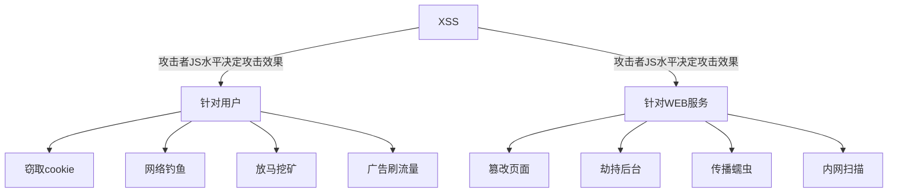

# XSS漏洞详解

跨站脚本攻击XSS(Cross Site Scripting)，为了不和层叠样式表(Cascading Style Sheets, CSS)的缩写混淆，故将跨站脚本攻击缩写为XSS。恶意攻击者往Web页面里插入恶意Script代码，当用户浏览该页面时，嵌入Web里面的Script代码会被执行，从而达到恶意攻击用户的目的。XSS攻击针对的是用户层面的攻击。危害如下：



## 流程

### 存储型

```sequence
participant 黑客
participant 用户
participant 正常服务器
participant 恶意服务器

黑客->正常服务器:发现正常服务器的XSS漏洞
黑客->正常服务器:在正常页面上构造XSS脚本并提交
用户->正常服务器:登录系统后访问页面请求
正常服务器-->用户:返回带有XSS脚本的页面
用户->恶意服务器:用户浏览器解析了XSS脚本，并将搜集信息发送
黑客->恶意服务器:获取搜集到的用户的信息
```

在个人信息或发表文章等地方插入代码后提交，如没有过滤或过滤不严，那这些代码将储存到服务器中，用户访问该页面的时候触发代码执行。该漏洞是持久化的，且不需要与用户进行交互。 存储型XSS比较危险，容易造成蠕虫、盗窃cookie等。攻击过程如下：

Bob拥有一个Web站点，该站点允许用户发布信息/浏览已发布的信息。

+ Alice检测到站点存在存储型的XSS漏洞。他在上面发布一个带有恶意脚本的热点信息，该热点信息存储在了站点服务器的数据库中，然后吸引其它用户来阅读该热点信息
+ Bob浏览该信息之后，恶意脚本在Bob的浏览器中执行
+ 此脚本盗窃敏感信息(cookie、帐号信息等信息)，然后在Bob完全不知情的情况下将这些信息发送给Alice
+ Alice利用获取到的cookie就可以Bob的身份登录B站点。如果脚本的功更强大的话，Alice还可以对Bob的浏览器做控制并进一步利用漏洞控制

### 反射型

```sequence
participant 黑客
participant 用户
participant 正常服务器
participant 恶意服务器

黑客->正常服务器:发现正常服务器的XSS漏洞
黑客->用户:发送带有XSS脚本的链接
用户->正常服务器:点击了恶意链接，进行访问请求
正常服务器-->用户:返回带有XSS脚本的页面
用户->恶意服务器:用户浏览器解析了XSS脚本，并将搜集信息发送
黑客->恶意服务器:获取搜集到的用户的信息
```

通过构造恶意链接能触发链接中的脚本执行，它需欺骗用户自己去点击链接才能触发XSS代码(服务器中没有这样的页面和内容)。一般容易出现在搜索页面。该漏洞是非持久化的，且需要与用户进行交互。 反射型XSS大多数是用来盗取用户的Cookie信息。攻击过程如下：

+ Alice发现站点存在反射性的XSS漏洞，利用网站的反射型XSS漏洞编写了一个exp，做成链接的形式，并利用各种手段诱使站点的用户Bob点击
+ Bob在登录到B站点后，点击了Alice提供的恶意链接，恶意脚本在Bob的浏览器中执行
+ 此脚本盗窃敏感信息(cookie、帐号信息等信息)，然后在Bob完全不知情的情况下将这些信息发送给Alice
+ Alice利用获取到的cookie就可以Bob的身份登录B站点。如果脚本的功更强大的话，Alice还可以对Bob的浏览器做控制并进一步利用漏洞控制

## 对抗

一般程序员都会用一些函数将构成xss代码的一些关键字符给过滤了。可是道高一尺魔高一丈，虽然过滤了，但还可以进行过滤绕过，以达到XSS攻击的目的。主要方法如下：

+ 通过更改标签，如大小写替换、空格/回车/Tab分割、标签内含``
+ 通过标签属性，如src加载、onload事件
+ 通过重新编码，如部分或全部的HEX编码、ASCII编码

更多绕过见文章[《XSS过滤绕过速查表》](https://www.freebuf.com/articles/web/153055.html)，实践见文章[《印尼电商平台Tokopedia的反射型XSS漏洞》](https://www.freebuf.com/vuls/207025.html)。

XSS的攻击载荷常见的有如下地点：

```js
// 以下所有标签的>都可以用//代替， 例如<script>alert(1)</script//
<link rel="stylesheet" href="http://www.xxx.com/atack.css"></link>

<script src="..."></script>

<style onload=alert(1)></style>
<style>@import ‘javascript:alert(‘hack‘);‘</style>

<svg onload=alert(1)/>
<svg onload=alert(1)///


<video src=1 onloadstart=alert(1)/>
```

XSS可以插入的地方有用户输入作为script标签内容、用户输入作为HTML标签名、用户输入作为HTML标签的属性值、用户输入作为HTML注释内容、直接插入到CSS里。举例如下：

```
#用户输入作为HTML注释内容，导致攻击者可以进行闭合绕过
<!-- 用户输入 -->
<!-- --><script>alert('hack')</script><!-- -->

#用户输入作为标签名，导致攻击者可以进行闭合绕过
<用户输入  id="xx" />
<><script>alert('hack')</script><b id="xx" />

#用户输入作为标签属性值，导致攻击者可以进行闭合绕过
<div id="用户输入"></div>
<div id=""></div><script>alert('hack')</script><div a="x"></div>

#用户输入作为标签属性名，导致攻击者可以进行闭合绕过
<div 用户输入="xx">  </div>
<div ></div><script>alert('hack')</script><div a="xx"> </div>

#用户输入作为CSS内容，导致攻击者可以进行闭合绕过
<style>用户输入<style>
<style></style><script>alert('hack')</script><style></style>
```

## 挖掘

### 黑盒测试

尽可能找到一切用户可控并且能够输出在页面代码中的地方，比如URL本身、URL的每一个参数、表单、搜索框等。常见业务场景如下：

+ 重灾区：评论区、留言区、个人信息、订单信息等等
+ 针对型：网页即时通讯、站内信、私信、意见反馈等
+ 存在风险：搜索框、当前目录、图片属性等

### 白盒测试

关于XSS的代码审计主要就是从接收参数的地方和一些关键词入手：

大多数程序会对接收参数封装在公共函数中统一调用，我们就需要审计这些公共函数看有没有过滤，能否绕过等。

可搜索类似`echo`这样的输出语句，跟踪输出的变量是从哪里来的，是否能控制。如果从数据库中取的，是否能控制存到数据库中的数据，存到数据库之前有没有进行过滤等等。

PHP中常见的接收参数的方式有`$_GET`、`$_POST`、`$_REQUEST`等等，可以搜索所有接收参数的地方，然后对接收到的数据进行跟踪，看看有没有输出到页面中，然后看输出到页面中的数据是否进行了过滤和html编码等处理。

